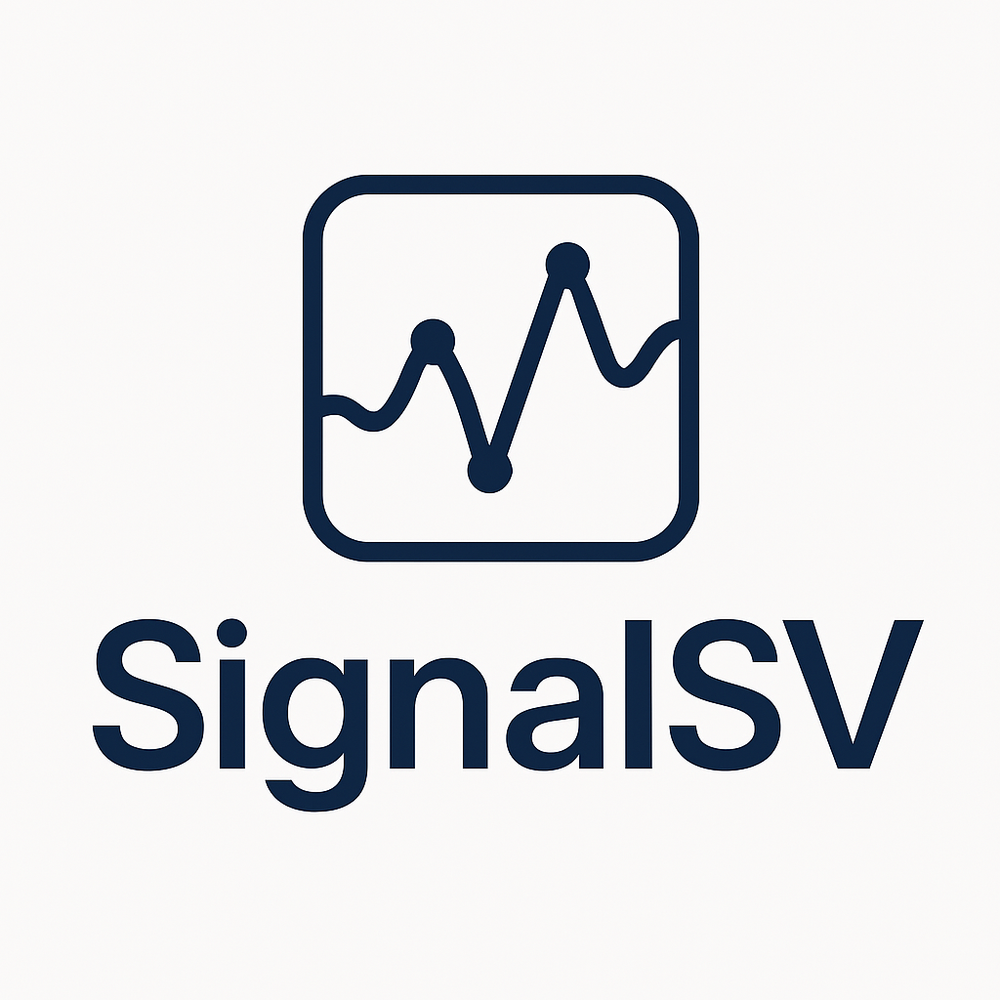

<p align="center">
  
</p>

# SignalSV

**SignalSV** is a modular simulation and analysis pipeline designed to explore and evaluate entropy-based signals associated with small structural variants. It generates synthetic DNA small SV fragments, profiles them using spaced k-mer entropy, applies unsupervised clustering, and computes probabilistic scores to assess signal strength. SignalSV is built for research, prototyping, and benchmarking.

---


[](LICENSE)

---

## 🚀 Features

- Small SV simulation with ground truth.
- Entropy-based variant detection with automatic Z-score calibration.
- DTW + Agglomerative clustering for phylogenetic signal resolution.
- KDE-based probability estimation for variant calls.
- Window mapping and gold standard evaluation with slack margin.
- Minimalist HTML dashboard for quick visualization.

---

## 📁 Project Structure

```
SignalSV/
│
├── logo/                         # Project logo and brand
│   └── logo.png
│
├── sv_gold_standard_simulator.py
├── SpacekmerEntropy.py
├── entropy_clustering.py
├── map_truth_to_windows.py
├── evaluate_prob_distributions.py
├── SignalSV.sh
│
├── environment.yml              # Conda environment
└── README.md                    # This file
```

---

## ⚙️ Installation

```bash
# Clone the repository
git clone https://github.com/Gutierrez-Escobar-AJ/SignalSV.git
cd SignalSV

# Create the conda environment
conda env create -f environment.yml

# Activate the environment
conda activate SignalSV
```

---

## 🧪 Run the full pipeline

```bash
./SignalSV.sh \
  --prefix test_run \
  --fasta tp53_ref.fasta \
  --mask 1101 \
  --window 50 \
  --step 25 \
  --zmode global \
  --num-svs 15 \
  --slack 50 \
  --prob-thresh 0.75
```

---

## 📊 Output

All results will be saved in the `<prefix>_SignalSV/` folder:

- `entropy_results.csv`  
- `entropy_plot.png`  
- `clustered_heatmap.png`  
- `clustered_tsne.png`  
- `clustered.nwk`  
- `clustered_labeled.csv`  
- `sv_probability_distribution.tsv`  
- `simulated_sv_truth.tsv`  
- `simulated_sv_truth_windows.tsv`

---

## 📄 License

MIT License. See `LICENSE` for details.

---

## 📖 How to Cite SignalSV

If you use **SignalSV** in your research or project, please cite:

> Gutierrez-Escobar AJ. (2024). *SignalSV: A Modular Entropy-Based Framework for Structural Variant Detection*. Zenodo. https://doi.org/10.5281/zenodo.15132676

---

## ✨ Acknowledgements

This tool was developed with ❤️ by [Gutierrez-Escobar-AJ](https://github.com/Gutierrez-Escobar-AJ).
